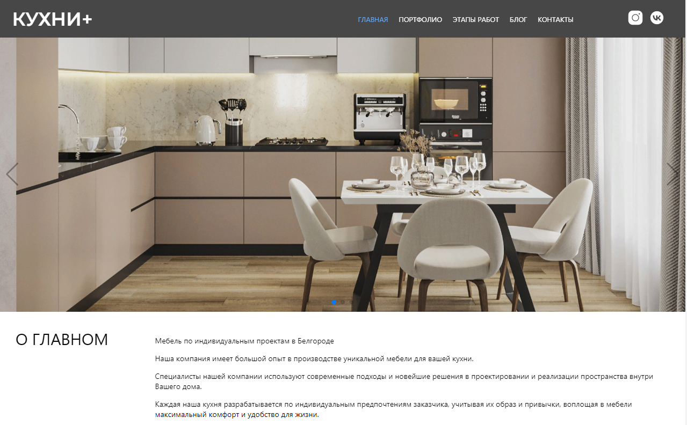
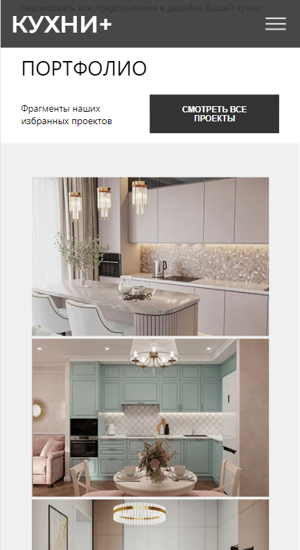

# **Кухни +**

### Студия мебели по индивидуальным проектам

## Описание

Сайт разработан с помощью бибилиотеки React для студии мебели по индивидуальным проектам.
Доступна возможность отправить данные на потовый адрес (email) через сайт.

## Технологии используемые в проекте:

### React (функциональный подход)

### react-hook-form (модальные окна с валидацией)

### PHPMailer (отправка данных на почту)

### Prettier

### Библиотека галереи, слайдера

Ссылка на сайт: [Кухни +](http://plus-kuhni.ru/)

#### Версия для компьютера:

#### Версия для мобильных устройств:

